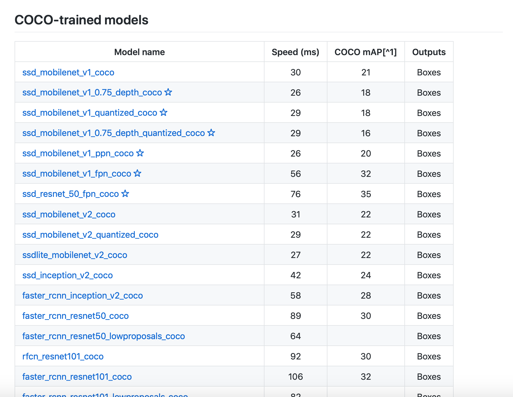

# Tensorflow Object Detection API Tutorial for multiple objects

<a name="TOP"></a>

## Intro.
*Created by Augustine H. Cha*  
*Last updated: 9 Feb. 2019*  

This is a tutorial for training an object detection classifier for multiple objects using the Tensorflow's Object Detection API.  

This is an implementation (and some additional info. according to my experience) of [TensorFlow Object Detection API on Windows 10](https://github.com/EdjeElectronics/TensorFlow-Object-Detection-API-Tutorial-Train-Multiple-Objects-Windows-10) by [EdgeElectronics](https://github.com/EdjeElectronics).

### Contents

1. [Install TensorFlow](#Install_TensorFlow)
2. [Download the TF Object Detection Repo. and a Pre-trained Classifier Model for This Tutorial](#Download_the_TF_Object_Detection_Repo)
3. [Download the repo. of the Tutorial by EdgeElectronics](#Download_the_repo_of_the_Tutorial_by_EdgeElectronics)
4. [Set up a New Anaconda Virtual Environment](#Set_up_a_New_Anaconda_Virtual_Environment)
5. [Test TensorFlow](#Test-TensorFlow)
6. [Create Your Custom Dataset](#Create_Custom_Dataset)
7. N/A

<a name="Install_TensorFlow"></a>
## Steps
### 1. Install TensorFlow
Install Tensorflow according to your system. This tutorial requires **tensorflow 1.9.0 or later** (I had encountered errors with some of the previous versions). I recommend to install Anaconda and Python 3.6 or higher as this tutorial would be using the Anaconda virtual environment.  

[This tensorflow-build source](https://github.com/lakshayg/tensorflow-build) offers a various custom builds of tensorflow. You may find the correct build file according to your OS and version of Python / gcc.  
  
<p align="center">
  
</p>

If you are using a GPU, download and install CUDA 9.0 and cuDNN 7.0.  
Note that macOS 10.14 (Mojave) *does NOT* support CUDA and cuDNN. 
  
Visit [Tensorflow's website](https://www.tensorflow.org/install/) for instructions on building tensorflow for your machine.  
Also please refer to [installation instructions](https://github.com/tensorflow/models/blob/master/research/object_detection/g3doc/installation.md)  

[back to top](#TOP)

<a name="Download_the_TF_Object_Detection_Repo"></a>
### 2. Download the TF Object Detection Repo. and a Pre-trained Classifier Model for This Tutorial
Download the [TensorFlow Object Detection repository](https://github.com/tensorflow/models) by clicking the "Clone or Download" button. Open the downloaded zip file and extract the “models-master”. I renamed “models-master” to “models” and moved the directory under `/Users/MY_USER_NAME/`.

Choose and download a pre-trained classifier at [TensorFlow Detection model zoo](https://github.com/tensorflow/models/blob/master/research/object_detection/g3doc/detection_model_zoo.md). Open the "NAME_OF_THE_MODEL.tar.gz" and extract the "NAME_OF_THE_MODEL" folder to the models/research/object_detection folder.

<p align="center">
  
</p>

If you are using terminal, type the commands below to extract `.tar.gz` or `.tar` files

```
tar -zxvf test.tar.gz
tar -xvf test.tar
```  

The Tensorflow detection model zoo provides a a collection of detection models pre-trained on the COCO dataset, the Kitti dataset, the Open Images dataset, the AVA v2.1 dataset and the iNaturalist Species Detection Dataset.

The metrics stated in the table are Speed and COCO mAP. Usually, for speed, the lower the faster; and more accurate if the mAP is higher.(See [MSCOCO evaluation protocol](http://cocodataset.org/#detection-eval) for more information.)

I will attach the links to the arXiv of the papers of SSD and faster R-CNN in case you are interested.  
- [SSD: Single Shot MultiBox Detector](https://arxiv.org/abs/1512.02325)  
- [Faster R-CNN: Towards Real-Time Object Detection with Region Proposal Networks](https://arxiv.org/abs/1506.01497)  

[back to top](#TOP)

<a name="Download_the_repo_of_the_Tutorial_by_EdgeElectronics"></a>
### 3. Download the repo. of the Tutorial by EdgeElectronics
Download the full repository of [TensorFlow Object Detection API on Windows 10](https://github.com/EdjeElectronics/TensorFlow-Object-Detection-API-Tutorial-Train-Multiple-Objects-Windows-10) and extract the contents into the models/research/object_detection folder. Or you can just add the following files and folders.  

folders 

- `inference_graph`
- `training`
- `images`
- `doc` (optional)

files

- `generate_tfrecord.py`
- `Object_detection_image.py`
- `Object_detection_video.py`
- `Object_detection_webcam.py`
- `resizer.py`
- `xml_to_csv.py`

Delete the following files if you are willing to train your own object detector with your own data. ***(Not the folders)***

- All files in `/object_detection/images/train` 
- All files in `/object_detection/images/test`
- `test_labels.csv` and `train_labels.csv` files in `/object_detection/images`
- All files in `/object_detection/training`
- All files in `/object_detection/inference_graph`

[back to top](#TOP)

<a name="Set_up_a_New_Anaconda_Virtual_Environment"></a>
### 4. Set up a New Anaconda Virtual Environment
Open a terminal and create and activate a virtual environment using Anaconda by issuing the following command:

```
$ conda create -n tf pip python=3.6
$ source activate tf
```
Install tensorflow in this environment by issuing:

```
# for CPU
(tf) $ pip install --ignore-installed --upgrade tensorflow
# for GPU
(tf) $ pip install --ignore-installed --upgrade tensorflow-gpu
```
Install other necessary packages by issuing the following commands:  

```
(tf) $ conda install -c anaconda protobuf
(tf) $ pip install pillow
(tf) $ pip install lxml
(tf) $ pip install Cython
(tf) $ pip install jupyter
(tf) $ pip install matplotlib
(tf) $ pip install pandas
(tf) $ pip install opencv-python
```

---

Configure the PYTHONPATH environment variable by issuing:  
**for macOS**

```
# use your user name at YOUR_USER_NAME 
# OR
# the directory you saved for models at step 2
(tf) $ export PYTHONPATH="$PYTHONPATH:/Users/YOUR_USER_NAME/models/:/Users/YOUR_USER_NAME/models/research/:/Users/AugustineCHA/models/research/slim"
```
**for Windows**  
assuming the directory is directly in C: drive

```
(tf) C:\> set PYTHONPATH=C:\models;C:\models\research;C:\models\research\slim

``` 
---
Next, change directories to the `models/research` directory and compile protobufs by issuing:

**for macOS**  
If you have homebrew:
`brew install protobuf`  
Alternative:  

```
curl -OL https://github.com/google/protobuf/releases/download/v3.3.0/$PROTOC_ZIP
sudo unzip -o $PROTOC_ZIP -d /usr/local bin/protoc
rm -f $PROTOC_ZIP
```
Run the compilation process:

```
# From /models/research/
protoc object_detection/protos/*.proto --python_out=.
```

**for Windows**  


```
# From \models\research\
protoc --python_out=. .\object_detection\protos\anchor_generator.proto .\object_detection\protos\argmax_matcher.proto .\object_detection\protos\bipartite_matcher.proto .\object_detection\protos\box_coder.proto .\object_detection\protos\box_predictor.proto .\object_detection\protos\eval.proto .\object_detection\protos\faster_rcnn.proto .\object_detection\protos\faster_rcnn_box_coder.proto .\object_detection\protos\grid_anchor_generator.proto .\object_detection\protos\hyperparams.proto .\object_detection\protos\image_resizer.proto .\object_detection\protos\input_reader.proto .\object_detection\protos\losses.proto .\object_detection\protos\matcher.proto .\object_detection\protos\mean_stddev_box_coder.proto .\object_detection\protos\model.proto .\object_detection\protos\optimizer.proto .\object_detection\protos\pipeline.proto .\object_detection\protos\post_processing.proto .\object_detection\protos\preprocessor.proto .\object_detection\protos\region_similarity_calculator.proto .\object_detection\protos\square_box_coder.proto .\object_detection\protos\ssd.proto .\object_detection\protos\ssd_anchor_generator.proto .\object_detection\protos\string_int_label_map.proto .\object_detection\protos\train.proto .\object_detection\protos\keypoint_box_coder.proto .\object_detection\protos\multiscale_anchor_generator.proto .\object_detection\protos\graph_rewriter.proto
```
---  
Run the following commands from the `/models/research/` directory:

```
python setup.py build
setup.py install
```  

[back to top](#TOP)

<a name="Test-TensorFlow"></a>
### 5. Test TensorFlow
Test the TensorFlow Object Detection API by launching `object_detection_tutorial.ipynb`using jupyter notebook from research/object_detection/ directory.

```
(tf) research/object_detection$ jupyter notebook object_detection_tutorial.ipynb
```

This will open an object detection tutorial script in your default web browser. You can test this script by clicking the "Run" button in the toolbar for each section. `In [*]` at the left of each section represents that the section is currently running and when the section is finished, the `'*'` would change to a number (e.g., `In[3]`).  

After successfully completing the script, you would see two images with labeled bound boxes at the bottom of the page. 

<p align="center">
  
</p>

[back to top](#TOP)

<a name="Create_Custom_Dataset"></a>
### 6. Create Your Custom Dataset
To train your own classifier, you need hundreds and thousands of images to train a model. Usually the more images you have, the better the result. Theses images should have the desired objects along with some random objects, various backgrounds, different illumination, rotation, partially obscured, overlapped, magnified, etc. 

You can either take pictures of your desired objects or download them from [Google Image Search](https://images.google.com) or [ImageNet](http://www.image-net.org). If you decided to create your own dataset by downloading images from ImageNet, you can use the [ImageNet-Utils](https://github.com/tzutalin/ImageNet_Utils). This util requires a *WorldNet ID or wnid* (e.g., n07739344) which uniquely identifies a synset.    

For example, if you are trying to detect `apples`, search for *"apple"* and choose any dataset you prefer from the search results. **(Feb 09, 2019) ImageNet is under maintenance. Only ILSVRC synsets are included in the search results.**  

<p align="center">
  
</p>

After selecting a synset, you would be able to download the URLs of the dataset from the `Download tab`. The wnid of this synset can be found at the end of the address bar.

<p align="center">
  
</p>

<!--[List of available data augmentation methods](https://github.com/tensorflow/models/blob/master/research/object_detection/protos/preprocessor.proto)


[SSH Port forwarding tensorboard](https://stackoverflow.com/questions/37987839/how-can-i-run-tensorboard-on-a-remote-server)-->