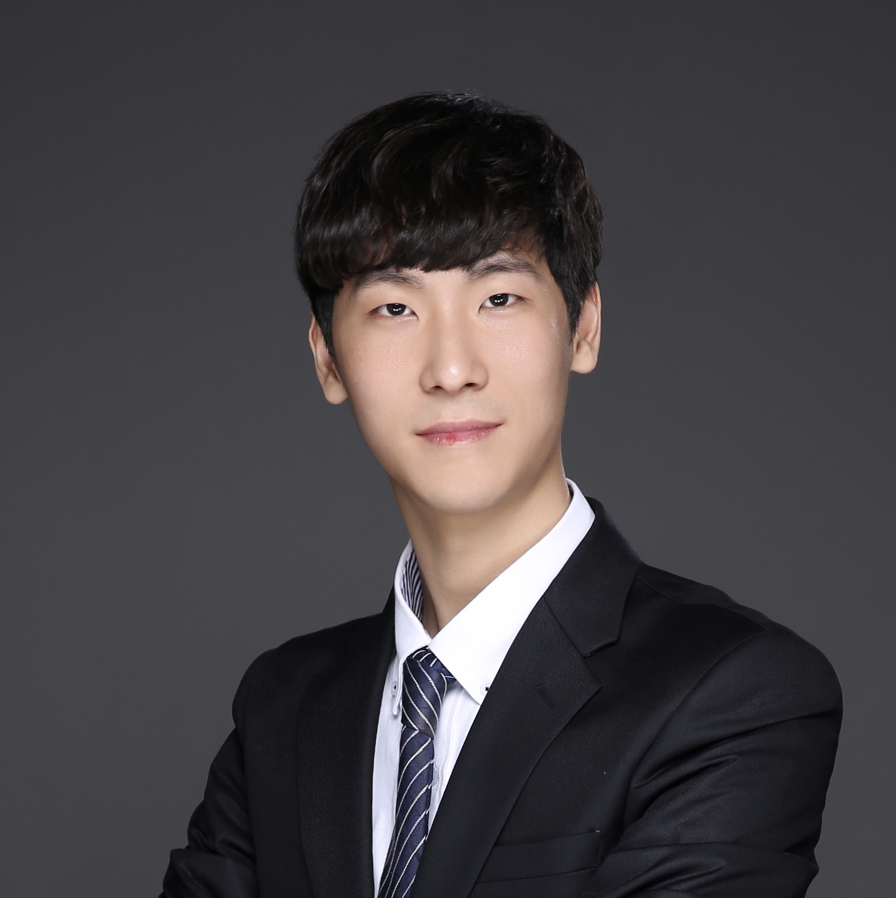
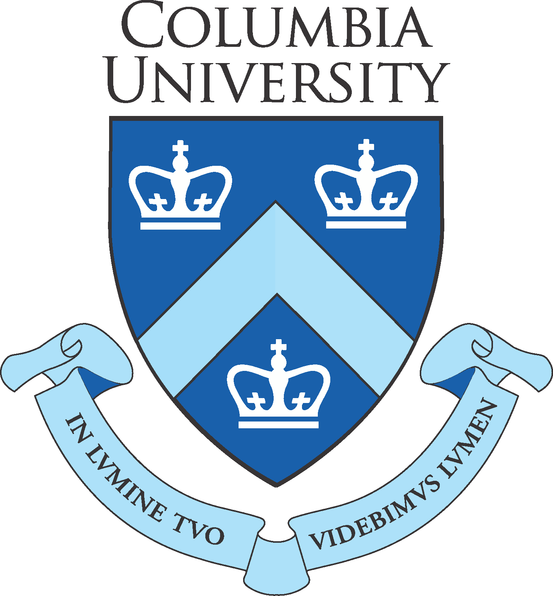

<!--

-->
<head>

</head>

# 
 Augustine Cha 

*
E-mail : augustine.cha@columbia.edu
*
*
LinkedIn : https://www.linkedin.com/in/augustinecha/
*

 Updated: Sept. 21, 2021  

<!--### I'll be working as a Research Engineer Intern  at  Microsoft this Summer!-->

## Interests
- Depth image enhancement, Time-of-Flight Sensors, Computer Vision, Machine Learning

## Education
<!--<right></right>
- **Konkuk University** <!-- Mar. 2011 ~ Feb. 2019  --> 

&emsp;&emsp; <b>Columbia University</b> 
&emsp;&emsp;  M.S. in <i>Computer Science</i> 
&emsp;&emsp;  Aug. 2019 ~ Jan. 2021 
&emsp;&emsp;  Research Assistant

  
 

&emsp;&emsp; <b>Konkuk University</b> 
&emsp;&emsp;  B.S. in <i>Electronics Engineering</i> 
&emsp;&emsp;  Mar. 2011 ~ Feb. 2019 
&emsp;&emsp;  Undergraduate Researcher

  
 
   
  
## Skills
- **Languages**: C++, Python, MATLAB, LaTeX, Markdown 
- **Frameworks**: OpenCV, PyTorch, TensorFlow
- **Others**: Scuba diving(PADI Adv. Open Water), Free diving(SSI Level 3)    

## Work Experience

- **Research and Development Engineer**  Jan. 2021 ~ Present  
*Microsoft*, Mountain View, California  

- **R&D Engineering Intern**  June. 2020 ~ Aug. 2020  
*Microsoft*, Mountain View, California  
	- Worked as a research and development engineering intern at Microsoft Time-of-Flight Research Team.
	- Developed a robust and power-efficient system for detection and localization of the sensor and multiple objects with passive and active imaging.
	- The framework developed to be flexible of using different sensors(e.g., IMU) and systems with low memory.
	- Developed a statistical approach to detect moving objects and track the objects using EKF.
	- Capable under both static or dynamic scenes using optical flow detection using feature matching
	- Capable of calculating the 6 degrees of freedom of the sensor and the moving object.

	
- **Software Engineer**   Dec. 2018 ~ Jun. 2019  
*Analogue plus*, Seongnam, South Korea  
	- Participating on a Smart Farm project to develop an autonomous harvesting system. Applying computer vision and deep learning algorithms to detect fruits in orchards. 
	- Developing path finding algorithms for a robot-arm to harvest detected fruits. 
	- Creating a GUI program for object detection using computer vision and deep learning algorithms.

	
## Research Experience
- **Graduate Research Assistant**   Feb. 2020 ~ Dec. 2020  
**Columbia University**
	- Currently working on invariant/equi-variant object detection for computer vision using meta learning techniques.  
- **Undergraduate Researcher**   Nov. 2016 ~ Jun. 2018  
**Konkuk University**
	- Applied saliency detection as a filtering weight to guide feature matching algorithms to increase matching reliability. Published an international paper and gave a poster presentation based on the work.
	- Collaborated with a colleague in a project on haze removal. Applied multi-scale superpixel using SLIC to establish a precise Dark Channel Prior(DCP) map. Published a domestic paper and gave a poster presentation based on the work. 
	- Conducted a self-project on a learning-based feature point detector by mimicking handcraft feature detecting algorithms using neural network. Applied auto-encoding networks to learn feature points produced by SIFT.

## Publications
- **Generative Interventions for Causal Learning**  
 Chengzhi Mao, **Augustine CHA**, Amogh Gupta, Hao Wang, Junfeng Yang, and Carl Vondrick  
*IEEE/CVF Conference on Computer Vision and Pattern Recognition(CVPR), Aug. 2020* [[PDF](https://arxiv.org/pdf/2012.12265.pdf)]

- **Saliency-guided feature matching for self-driving systems**  
 **Augustine H. CHA** and Wonjun Kim  
*IEEE International Conference on Consumer Electronics-Asia(ICCE-Asia), Jun. 2018* [[PDF](https://ieeexplore.ieee.org/stamp/stamp.jsp?tp=&arnumber=8552102)]

<!--- **다중 스케일 기반 영상 분할을 이용한 안개 제거 방법** (Haze removal via multi-scale superpixel)  
Jehee Tae, **Augustine H. CHA**, Wonjun Kim  
*30th Workshop on Image Processing and Image Understanding(IPIU), Feb. 2018* [[PDF](https://drive.google.com/uc?id=1lwTIgb3-dF6c4RReFDt20xdonfhZOZUW)] 

- **관심영역 기반 특징점 정합을 이용한 무인 이동체 위치 추정 방법** (Method for locating an unmanned vehicle using saliency based feature matching)  
**Hyunjong A. CHA**, Gyu-In Jee, Wonjun Kim  
*Society for Aerospace System Engineering Spring Conference, Apr. 2017* [[PDF](https://drive.google.com/uc?id=1Sllhp4yeR0Z4Ct8VOHB8FBr59pNBgtYG)]  -->

<!--## Honors and Awards
- **Academic Excellence Scholarship**, Konkuk Univ., Korea  Spring 2018  
- **Silver Prize**, Capstone Design Contest, Konkuk Univ., Korea  Nov. 2017  
- **Best Paper Award**, SASE Spring Conference, Korea  Nov. 2017  
- **Finalist**, Smart Model Car Contest, Hanyang Univ.  Jul. 2017  
- **Excellence Award**, 4th Unithon(United Hackerthon), Korea  Feb. 2017   
- **Special Prize**, Graduation Project Exhibition, Konkuk Univ.  Nov. 2016  -->

<!--## Personal Activities
- Vice President of Club *X[deca]*   Jan. 2017 ~ Dec. 2017  
*Club Activity of Electronics, Robotics and Software* 
- Exploring around the World   Jan. ~ Dec. 2015  
*330 Days, 6 Continents, 36 Countries and 124 Cities*  
- Working Holiday   Feb. 2014~Jan. 2015  
*Gold Coast, Australia* 
- Military Service   Feb. 2012 ~ Nov. 2013  
*R.O.K Army* -->

<!--## Language
- Fluent in English and native in Korean(Dual citizenship)-->

<!--## Personal Activities
- Vice President of Club *X[deca]*   Jan. 2017 ~ Dec. 2017  
*Club Activity of Electronics, Robotics and Software Developement* 
- Traveling around the World   Jan. ~ Dec. 2015  
*330 Days, 6 Continents, 36 Countries and 124 Cities*  -->